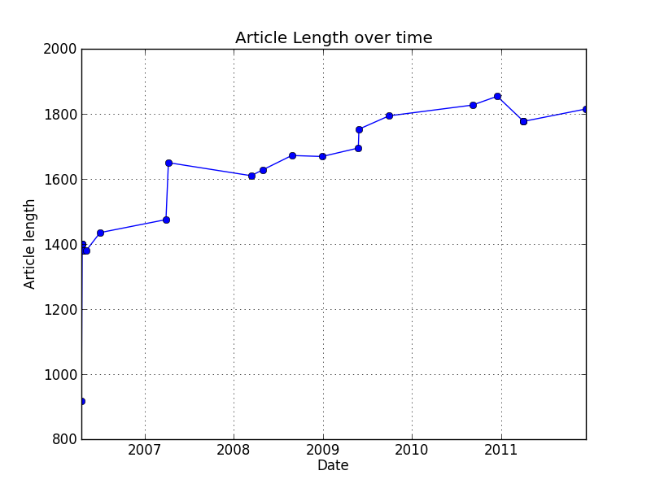

Time vs Article Length Plot
============================

.. code-block:: python
    :emphasize-lines: 1

    #Requires matplotlib
    import matplotlib
    from pylab import (xlabel, ylabel, title, grid, plot_date, show)
     
    rlengths = [len(revision.plaintext) for revision in page.revisions]
    revision_times = [revision.timestamp for revision in page.revisions]
    # Convert to matplotlib date format
    dates = matplotlib.dates.date2num(rtimes)
    plot_date(dates, rlengths), linewidth=1.0, linestyle='-')
    title('Sentence count over time')
    ylabel('Article length')
    grid(True)
    show()
